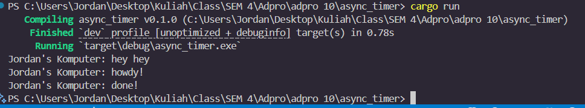

## Understanding How It Works

1. The main function prints "Jordan's Komputer: hey hey" immediately.
2. An async task is spawned, which prints "Jordan's Komputer: howdy!" and then waits for a 2-second timer.
3. The executor runs, sees the task is waiting, and yields.
4. After 2 seconds, the timer completes, the task resumes, and prints "Jordan's Komputer: done!".
