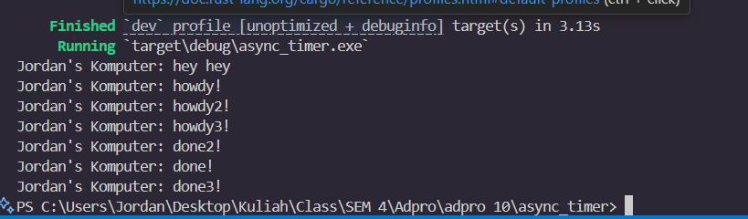

### Understanding How It Works

1. The main function prints "Jordan's Komputer: hey hey" immediately.
2. An async task is spawned, which prints "Jordan's Komputer: howdy!" and then waits for a 2-second timer.
3. The executor runs, sees the task is waiting, and yields.
4. After 2 seconds, the timer completes, the task resumes, and prints "Jordan's Komputer: done!".

### Multiple Spawn and Removing Drop

The order of "howdy" messages is always the same (spawn order), but the "done" messages can appear in any order after the timers complete, depending on task scheduling. This is a trait of using async executors to explicitly control task order. when using drop(spawner) the executor knows no more tasks will be added and will exit once all current tasks are finished. If we dont use the drop spawner, the executor will wait forever for new tasks, causing the program to hang even after all tasks are done.

